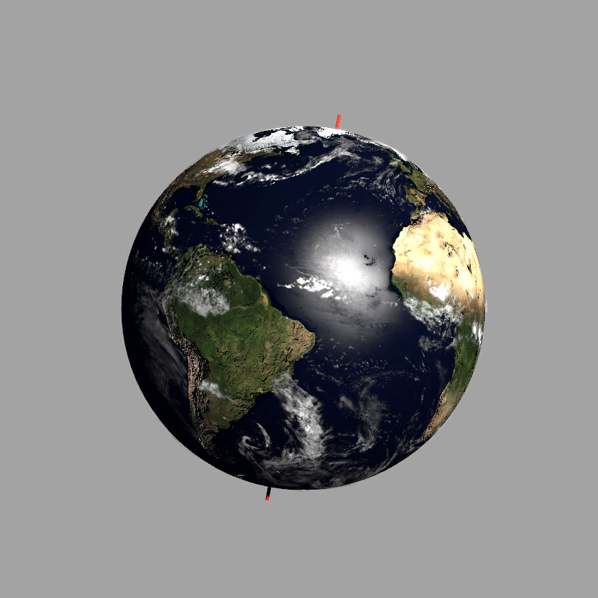
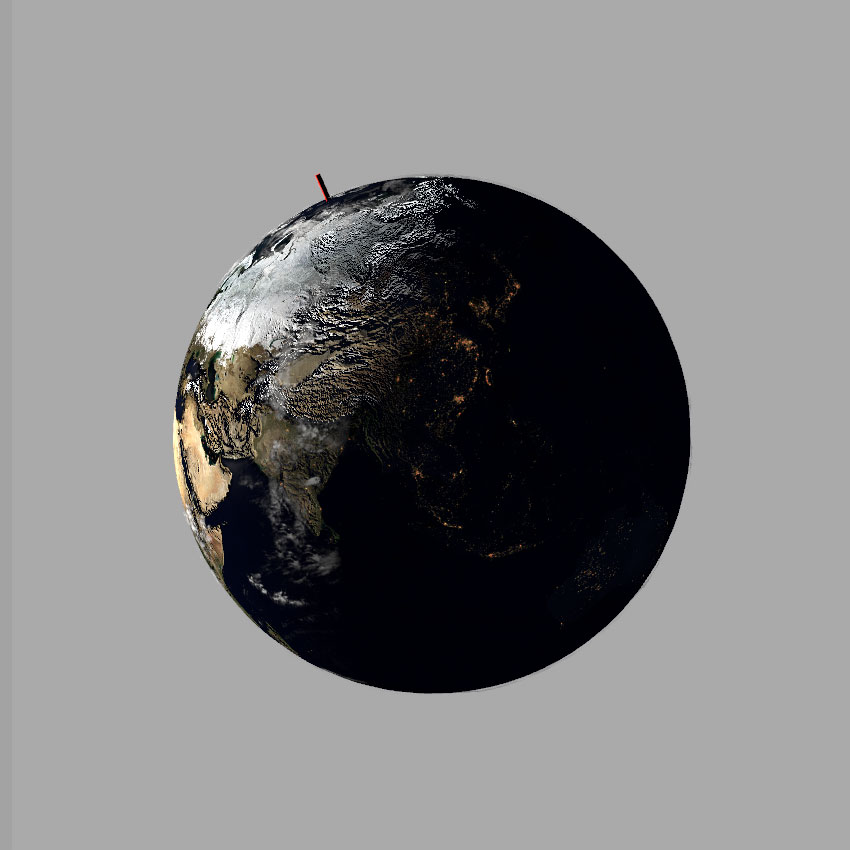

# SceneKit Earth
Spinning earth with seasonal tilt, clouds, shadows and night time cities packaged as a simple playground

Once open, ensure you open the assistant editor in XCode to see the SCNView.

## Images
Image textures are mostly 3K and are originally sourced from [NASA's Blue Marble image set](https://visibleearth.nasa.gov/view_cat.php?categoryID=1484).

## Screenshots

